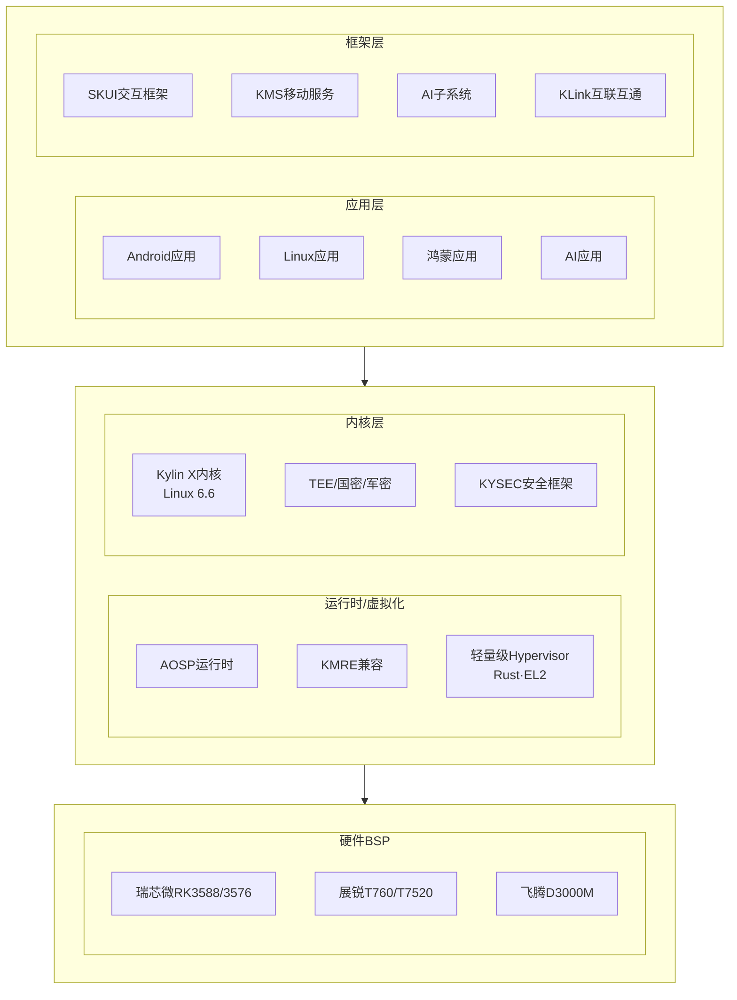

# 内核开发学习方案 — 4个月冲刺太初OS工程师（含GPU）

---

## 个人基本情况

- **姓名**：王苏东
- **学历**：本科
- **工作年限**：6年
- **当前公司**：麒麟软件（国产 OS 发行版）
- **工作内容**：OS 发行版构建与发布（打包、编译、集成、多架构适配、软件包移植），**不涉及内核开发**（公司有专门的内核部门）
- **编程语言**：Python（掌握）、TypeScript（掌握）、Shell（精通）、C（基础很差）
- **架构经验**：x86、ARM64、MIPS、LoongArch64、SW_64 — 都是 OS 构建层面的适配，不涉及内核/驱动
- **核心能力**：
  - 6 年 Linux 发行版构建经验，熟悉从源码到 ISO 的完整流程
  - 带队从零构建 OS 通过国家级信创认证
  - 独立开发数万行代码的系统工具（Python/TS/Shell）
  - 熟悉交叉编译、包管理（RPM/DEB）、自动化构建
  - AI 辅助开发实战（Claude Code、Cursor、MCP、Vibe Coding）
- **短板**：
  - **C 语言几乎零基础** — 从未写过 C 代码项目
  - **内核零基础** — 从未接触过内核源码、内核模块、驱动开发
  - **无硬件/嵌入式经验** — 不熟悉寄存器、设备树、BSP
  - **无算法/数据结构系统训练** — 偏工程实现，理论基础薄弱
- **转型意向**： OS内核相关岗位
- **当前薪资**：15K×14薪（年包 21 万）

## 目标岗位：太初 操作系统工程师

- **薪资**：30-60K·15薪
- **经验要求**：经验不限
- **公司背景**：太初是国产 GPU 芯片公司（自研 GPU），OS 岗位必然涉及 GPU 相关的操作系统优化
- **岗位要求（JD 核心要点）**：
  - 负责操作系统相关开发、优化和维护
  - 熟悉 Linux 内核原理，有内核开发经验优先
  - 熟悉操作系统性能分析和调优
  - 熟悉 GPU 体系结构或有 GPU 相关开发经验优先
  - 熟悉多架构（x86/ARM）开发和调试
  - 有良好的 C 语言编程能力
- **面试评估**：
  - "经验不限"说明不是招资深内核专家，更看重基础能力和学习潜力
  - 但 C 语言和内核基础是硬门槛，面试一定会考
  - 6 年 OS 构建经验是加分项（理解系统全局视角、多架构适配），需要包装好
  - GPU 知识是差异化优势 — 大部分候选人不会 CUDA/GPU 架构

## 学习硬件环境

- **台式机（主力开发机）**：i5-13600KF + RTX 4080 + 64GB DDR5（4×16G）+ 1TB NVMe SSD
  - 装双系统：Windows（游戏）+ Ubuntu 26.04 LTS（开发）
  - GPU 学习直接用 RTX 4080（CUDA、性能分析）
- **Mac Mini M4**：日常使用，不适合作为 ARM 开发设备（Apple Silicon ≠ 标准 ARMv8 飞腾/鲲鹏）
- **ARM 平台**：用 QEMU 模拟标准 ARMv8，与飞腾/鲲鹏架构一致，不购买物理 ARM 设备
- **N100 设备**（32G 内存）：不做学习用途，性能太弱

## 学习策略

- **4 个月时间线**：C 语言地基 → 内核模块 → 子系统原理+GPU → 多架构项目+面试
- **不购买额外设备**：一台台式机 + QEMU 搞定所有架构
- **Month 1 不用 AI**：C 语言必须手写建立肌肉记忆
- **Month 2-3 AI 当老师**：解释源码、定位函数、解释报错，但不代写代码
- **Month 4 正常用 AI**：生产力工具，跟工作一样用
- **每个知识点都配可运行代码**：光看书不过手 = 没学

---

## Month 1：C语言 + 编程基础

> 这个月不碰内核，只把C练熟。跳过这步后面全白费。

### Week 1：C语言语法 + 指针

**每天 6-8 小时，目标：能读懂C代码，指针不晕**

Day 1：环境搭建 + 第一个程序 + 编译模型
- 安装编译器：`clang --version`（Mac 自带）/ Ubuntu 装 `gcc`
- 写第一个 hello.c，编译运行
- **必须理解编译四阶段**（这是 C 和 Python 最大的区别 — C 没有解释器，必须先编译）：
  1. 预处理（Preprocessing）：展开 `#include`、替换 `#define`、处理条件编译 `#ifdef`
     ```bash
     gcc -E hello.c -o hello.i   # 查看 .i 文件，看 #include 展开了什么
     ```
  2. 编译（Compilation）：C 代码 → 汇编代码
     ```bash
     gcc -S hello.i -o hello.s   # 查看 .s 文件，这是汇编语言
     ```
  3. 汇编（Assembly）：汇编代码 → 机器码（.o 目标文件）
     ```bash
     gcc -c hello.s -o hello.o   # .o 是二进制，不能直接看
     ```
  4. 链接（Linking）：多个 .o + 库函数 → 可执行文件
     ```bash
     gcc hello.o -o hello        # 把 printf 的实现链接进来
     ```
- **必须理解的 C 语言特有概念**（Python/JS 里没有的）：
  - C 是静态类型语言，变量必须声明类型（`int a;` 不能写 `a = 1`）
  - C 没有垃圾回收，内存必须手动管理
  - C 没有字符串类型，字符串是 `char` 数组，以 `\0` 结尾
  - C 没有异常机制，错误靠返回值（-1）或 errno
  - C 的数组不记录长度，你必须自己记住
- 练习：
  1. 手动走一遍四阶段编译，每步查看输出文件
  2. 写一个 hello.c，用 `#define` 定义常量，观察预处理后的变化
  3. 写一个两文件项目（main.c 调用 utils.c 的函数），体验链接阶段

Day 2：基本类型 + 控制流 + 函数
- **数据类型**（必须知道每种占多少字节）：
  - `char`（1字节）、`short`（2字节）、`int`（4字节）、`long`（8字节，64位系统）
  - `float`（4字节）、`double`（8字节）
  - `unsigned` vs `signed` 的区别
  - `sizeof()` 运算符 — 验证每种类型大小
  - 整数溢出问题（int 最大值 2^31-1 = 2147483647，溢出会怎样？）
- **变量和常量**：
  - 局部变量（栈上，函数结束就没了）
  - 全局变量（数据段，程序全程存在）
  - `static` 变量（作用域限制在文件内 / 函数内持久化）
  - `const` 修饰符（不可修改，编译器帮你检查）
  - `#define` vs `const` 的区别
- **运算符**（注意 C 独有的）：
  - 算术：`+ - * / %`（`%` 取模只用于整数）
  - 自增自减：`++ --`（前缀 vs 后缀的区别）
  - 位运算：`& | ^ ~ << >>`（内核大量使用，后续专门练）
  - 三目运算符：`条件 ? 值1 : 值2`
  - 逗号运算符：`(a, b)` 整个表达式的值是 b
  - `sizeof` 是运算符不是函数
- **控制流**（跟 Python/JS 类似，注意语法差异）：
  - if/else — 注意 C 没有 bool 类型（用 0 和非 0），直到 C99 才有 `_Bool`
  - switch/case — 注意必须写 `break`，否则会穿透（fall-through）
  - for/while/do-while — 注意 for 的三部分都可以省略
  - `break` 和 `continue`
- **函数**：
  - 函数声明（原型）vs 函数定义 — 为什么需要先声明？因为编译器从上往下读
  - 参数传递：C 只有值传递！要改外部变量必须传指针
  - `void` 函数（无返回值）
  - 可变参数函数（`printf` 就是这样实现的，知道就行）
  - `inline` 函数（编译器建议内联展开）
- 练习：
  1. 打印每种类型的 sizeof，跟预期对比
  2. 写一个 int 溢出的例子，观察结果
  3. 写一个计算器（加减乘除），支持命令行输入
  4. 写 swap 函数（错误版：值传递不生效 → 正确版：用指针）

Day 3：字符串 + 数组
- **字符串**（C 里最容易出 bug 的地方）：
  - 字符串 = `char` 数组 + `\0` 终止符
  - `"hello"` 实际是 `{'h','e','l','l','o','\0'}`，占 6 字节不是 5
  - 字符数组 vs 字符指针：`char s[] = "hello"` vs `char *s = "hello"`（前者可修改，后者不可）
  - 必须掌握的 string.h 函数：
    - `strlen`（长度，不含 `\0`）
    - `strcpy / strncpy`（复制，`strncpy` 更安全）
    - `strcat / strncat`（拼接）
    - `strcmp / strncmp`（比较，返回 0 表示相等）
    - `strchr / strrchr`（查找字符）
    - `strstr`（查找子串）
    - `strdup`（复制字符串，返回 malloc 的指针，要 free）
  - 缓冲区溢出：`strcpy` 不检查目标大小 — 这是无数安全漏洞的根源
  - `sprintf / snprintf`（格式化写字符串）
- **数组**：
  - 一维数组：声明、初始化、遍历
  - 数组名是指向首元素的指针（大部分情况下）
  - `sizeof(arr)` vs `sizeof(arr[0])` 计算数组长度
  - 数组不能直接赋值（`int a[5]; int b[5]; a = b;` 不行）
  - 多维数组：`int mat[3][4]` — 内存中是连续的
  - 数组作为函数参数时退化为指针（丢失长度信息）
- 练习：
  1. 实现自己的 strlen、strcpy、strcmp（不用库函数）
  2. 写一个函数反转字符串（原地反转，不分配新内存）
  3. 写一个函数判断字符串是否回文
  4. 故意写一个缓冲区溢出，观察程序崩溃

Day 4：指针入门 + 指针与数组
- **指针基础**（这是 C 的核心，必须彻底搞懂）：
  - 内存模型：每个字节有地址，指针就是存储地址的变量
  - `&` 取地址运算符：`int a = 42; &a` 得到 a 的地址
  - `*` 解引用运算符：`int *p = &a; *p` 得到地址处的值（42）
  - 指针的类型决定解引用时读多少字节：`int *` 读 4 字节，`char *` 读 1 字节
  - 指针本身也是变量，占 8 字节（64 位系统）
  - 野指针：未初始化的指针，指向随机地址，解引用会崩溃
  - NULL 指针：`int *p = NULL;` — 解引用 NULL 也会崩溃（segmentation fault）
  - 悬空指针：指针指向的内存已经被 free 了
- **指针和数组的关系**：
  - `arr[i]` 等价于 `*(arr + i)` — 编译器看到 `arr[i]` 就翻译成 `*(arr+i)`
  - `&arr[i]` 等价于 `arr + i`
  - 指针算术：`p + 1` 不是地址 +1，而是移动 `sizeof(*p)` 个字节
  - 数组传参退化为指针：`void f(int arr[])` 等价于 `void f(int *arr)`
  - 不能对数组名做 `arr++`（数组名是常量地址）
- **指针常见陷阱**：
  - 返回局部变量地址（栈上的变量函数结束就没了）
  - 指针类型不匹配（`int *p = (float *)malloc(...)`）
  - 忘记检查 malloc 返回 NULL
- 练习：
  1. 打印变量的地址和值，理解 `&` 和 `*`
  2. 用指针遍历数组，实现 reverseArray
  3. 写 swap 函数（必须用指针参数）
  4. 实现字符串长度函数 strlen（用指针遍历，不用数组下标）
  5. 故意解引用 NULL 指针，看 segment fault
  6. 故意返回局部变量地址，在调用方打印看乱码

Day 5：多级指针 + 函数指针 + 枚举/联合体
- **多级指针**：
  - 二级指针 `int **pp`：指向指针的指针
  - 什么时候需要：函数内修改外部指针（如 `void alloc(int **pp)`）
  - 指针数组 vs 数组指针：`int *arr[5]`（5 个指针）vs `int (*arr)[5]`（指向 5 元素数组的指针）
  - 理解声明读法：从变量名开始，先往右看再往左看
- **函数指针**：
  - 声明：`int (*func_ptr)(int, int)` — 指向"接收两个 int 返回 int 的函数"的指针
  - 用途：回调函数（callback）、策略模式、内核的 file_operations
  - 函数指针数组：`int (*ops[])(int,int) = {add, sub, mul};` — 类似 Python 的函数列表
  - typedef 简化：`typedef int (*op_func)(int,int);`
- **enum 枚举**：
  - `enum color { RED, GREEN, BLUE }` — 本质是 int（0,1,2）
  - 内核大量使用 enum 定义命令码、状态码
- **union 联合体**：
  - 所有成员共享同一块内存（大小 = 最大成员的大小）
  - 用途：类型 punning、网络包解析、内核的通用数据结构
  - 跟 struct 的区别：struct 每个成员有自己的空间，union 共享空间
- 练习：
  1. 写一个通用排序函数，用函数指针做比较器（类似 qsort）
  2. 用二级指针实现动态字符串数组（add/remove/print）
  3. 用 enum + 函数指针数组实现一个简易计算器
  4. 用 union 实现一个既能存 int 又能存 float 的"变体"类型

Day 6-7：结构体 + 内存对齐 + typedef
- **struct 结构体**：
  - 定义、初始化（三种方式：逐个赋值、花括号、指定初始化器）
  - 成员访问：`.` vs `->`（通过指针访问时用 `->`）
  - 嵌套结构体
  - 结构体数组
  - 结构体指针作为函数参数（避免拷贝整个结构体）
  - 匿名结构体（C11）
- **typedef**：
  - 给类型起别名：`typedef unsigned char u8;`
  - 简化结构体：`typedef struct { int x; int y; } Point;`
  - 内核大量使用 typedef：`pid_t`, `size_t`, `ssize_t`, `u32`, `bool`
- **内存对齐**（面试必考，内核开发必懂）：
  - 为什么对齐：CPU 访问对齐的内存更快，某些架构不对齐会崩溃
  - 规则：每个成员的偏移量必须是其大小的整数倍
  - 结构体总大小是最大成员大小的整数倍
  - `__attribute__((packed))` 取消对齐（内核偶尔用）
  - `alignas` / `_Alignas`（C11）
  - 用 `offsetof` 宏查看成员偏移量
  - 手动计算 sizeof，再用代码验证
- **柔性数组（Flexible Array Member）**：
  - `struct buf { int len; char data[]; };` — 最后一个成员是变长数组
  - 内核大量使用这种技巧
- 练习：
  1. 定义 Student 结构体（name, age, scores），实现排序（按成绩）
  2. 手动计算几个结构体的 sizeof 和成员偏移，写代码验证
  3. 用结构体 + 函数指针实现"类"（模拟面向对象）
  4. 定义链表节点结构体，用手算 sizeof 验证内存对齐

### Week 2：内存管理 + 数据结构

Day 8：动态内存管理
- **C 内存模型**（必须理解，跟 Python/JS 完全不同）：
  - 栈（Stack）：局部变量，自动分配释放，速度快但空间小（默认 ~8MB）
  - 堆（Heap）：malloc 分配，手动 free，空间大但速度慢
  - 全局/静态区（Data/BSS）：全局变量和 static 变量
  - 代码段（Text）：编译后的机器指令（只读）
  - 常量区（rodata）：字符串字面量、const 全局变量
- **malloc 家族**：
  - `malloc(size)` — 分配 size 字节，内容未初始化（可能含垃圾数据）
  - `calloc(n, size)` — 分配 n×size 字节，全部初始化为 0
  - `realloc(ptr, new_size)` — 扩大或缩小已分配的内存（可能移动地址！）
  - `free(ptr)` — 释放内存，ptr 必须是 malloc/calloc/realloc 返回的指针
  - `aligned_alloc(alignment, size)` — 分配对齐的内存（内核常用）
- **内存错误类型**（每种都要会识别和避免）：
  - 内存泄漏（Memory Leak）：malloc 了没 free，进程占用的内存越来越多
  - Use-after-free：free 了之后还在用那块内存
  - Double-free：同一个指针 free 了两次
  - 缓冲区溢出（Buffer overflow）：写超出分配的大小
  - 未初始化读取：malloc 的内存没初始化就拿来用
  - 返回栈地址：函数返回后局部变量的地址失效
- **调试工具**：
  - Valgrind：`valgrind --leak-check=full ./program` — 检测内存泄漏和越界
  - AddressSanitizer：`gcc -fsanitize=address -g` — 编译时插桩检测（比 valgrind 快）
  - `gdb` 基础：`break`、`run`、`next`、`step`、`print`、`continue`
- 练习：
  1. 实现动态数组（支持 push/pop/insert/remove，自动扩容）
  2. 故意写 5 种内存错误，用 valgrind 和 ASan 分别检测，读懂报错信息
  3. 用 gdb 单步调试动态数组的扩容过程

Day 9：链表（重中之重）— 内核最重要的数据结构
- **单链表**：
  - 节点定义：`typedef struct Node { int val; struct Node *next; } Node;`
  - 头插法 vs 尾插法
  - 遍历、查找、插入（在指定节点后）、删除
  - 反转（迭代法 + 递归法）
  - 找中间节点（快慢指针）
  - 检测环（快慢指针）
  - 合并两个有序链表
- **双链表**：
  - 节点定义：增加 `prev` 指针
  - 插入和删除比单链表简单（不需要找前驱）
- **为什么内核用链表**：
  - 内核的 `list_head` 结构：只有 `prev` 和 `next`，没有数据
  - 通过 `container_of` 宏从 `list_head` 反推出宿主结构体
  - 这跟普通链表完全反过来：不是"节点包含数据"，而是"数据包含节点"
  - 这种设计一个结构体可以同时挂在多个链表上
- **哨兵节点（dummy head）技巧**：
  - 简化边界处理（空链表、头节点操作）
  - 内核的 `LIST_HEAD()` 宏就是创建哨兵
- 练习：
  1. 实现完整的单链表库（.h + .c），至少 10 个操作（create/destroy/push/pop/insert/remove/find/reverse/length/print）
  2. 实现双链表
  3. 用快慢指针实现找中间节点和检测环
  4. 用链表实现 LRU 缓存（面试常考：get/set 操作 O(1)）

Day 10：栈 + 队列
- **栈（LIFO）**：
  - 用数组实现：`int stack[MAX]; int top = -1;` — push/pop/top/is_empty
  - 用链表实现：头插头删
  - 应用：括号匹配、表达式求值、函数调用栈、DFS
- **队列（FIFO）**：
  - 用链表实现：维护 head 和 tail 指针
  - 循环队列（数组实现）：`front` 和 `rear` 取模
  - 应用：BFS、任务调度、内核的等待队列
- **双端队列（Deque）**：
  - 两端都能进出的队列
  - 用双链表实现最简单
- 练习：
  1. 括号匹配：读一个表达式，检查括号是否合法 `({[]})`
  2. 用两个栈实现队列（面试经典）
  3. 用队列实现栈
  4. 实现一个简单的浏览器前进/后退功能（两个栈）

Day 11-12：哈希表
- **哈希表原理**：
  - key → hash 函数 → 数组下标 → 存储 value
  - 理想情况 O(1) 查找
  - hash 函数要求：均匀分布、计算快、确定性（相同输入永远相同输出）
  - 简单 hash 函数示例：`hash("hello") = (h*31 + char) % size`
- **冲突解决**：
  - 拉链法（Chaining）：每个桶是一个链表 — 内核用的就是这种
  - 开放寻址法（Open Addressing）：冲突了找下一个空位
  - 装载因子（load factor）：元素数/桶数，超过阈值要扩容（rehash）
- **哈希表实现要点**：
  - 动态扩容：元素超过装载因子阈值时，分配更大的数组，重新 hash 所有元素
  - 删除：拉链法直接删节点，开放寻址要做惰性删除（标记已删）
- 练习：
  1. 实现一个哈希表（字符串 key → int value），支持 get/set/delete
  2. 加上动态扩容
  3. 统计一篇文章中每个单词出现的频率（用你的哈希表）

Day 13-14：树基础 + 算法入门
- **二叉树**：
  - 节点定义、创建、遍历（前序/中序/后序 — 递归 + 迭代）
  - 层序遍历（BFS，用队列）
  - 树的高度、节点数
- **二叉搜索树（BST）**：
  - 左 < 根 < 右
  - 插入、查找、删除（删除最难：分三种情况）
  - 中序遍历是有序序列
  - 最坏情况退化为链表（所有节点只有左/右孩子）
- **红黑树概念**（不需要实现，但要理解为什么存在）：
  - BST 的平衡问题 → 红黑树通过旋转保持平衡
  - 内核 CFS 调度器用红黑树管理进程
  - 了解 5 条规则即可：根是黑色、叶子（NIL）是黑色、红色节点的孩子是黑色...
- 练习：
  1. 实现二叉搜索树（insert/search/delete/traverse）
  2. 用递归和迭代两种方式实现前/中/后序遍历
  3. 判断一棵树是否是 BST

### Week 3：文件I/O + 编译深入 + 位操作

Day 15：文件 I/O（标准库版）
- **文件操作基础**：
  - `fopen` 模式：`"r"` 读、`"w"` 写（覆盖）、`"a"` 追加、`"rb"/"wb"` 二进制
  - `fread / fwrite`：二进制读写（读 struct、数组等）
  - `fgets / fputs`：按行读写文本
  - `fprintf / fscanf`：格式化读写（类似 printf/scanf 但到文件）
  - `fclose` — 必须关闭！否则缓冲区数据可能丢失
- **文件指针操作**：
  - `fseek(fp, offset, SEEK_SET/SEEK_CUR/SEEK_END)` — 移动文件指针
  - `ftell(fp)` — 获取当前偏移量
  - `rewind(fp)` — 回到文件开头
  - `feof(fp)` — 判断是否到文件末尾（注意：要在读操作之后检查）
- **缓冲区**：
  - 全缓冲（默认）：填满缓冲区才写磁盘
  - 行缓冲（终端）：遇到 `\n` 就刷新
  - 无缓冲：立即写入（`setvbuf` 设置）
  - `fflush(fp)` — 手动刷新缓冲区
- **错误处理**：
  - `ferror(fp)` — 检查文件操作是否出错
  - `perror("msg")` — 打印错误信息（配合 errno）
  - `errno` — 全局错误码变量
- 练习：
  1. 实现 `cp` 命令（复制文件，支持二进制文件）
  2. 实现 `wc` 命令（统计行数/单词/字符）
  3. 写一个 CSV 解析器（读 CSV 文件，按行按列解析）
  4. 读 `/proc/cpuinfo` 解析 CPU 型号和核心数

Day 16：文件 I/O（系统调用版）+ 文件系统
- **系统调用 vs 标准库**：
  - `open/close/read/write` — 系统调用（无缓冲，直接内核交互）
  - `fopen/fread/fwrite` — 标准库（有缓冲区，封装了系统调用）
  - 为什么要学系统调用版？因为内核模块只能用系统调用的思路
- **系统调用文件操作**：
  - `open(path, flags, mode)` — flags: `O_RDONLY/O_WRONLY/O_RDWR/O_CREAT/O_TRUNC/O_APPEND`
  - `read(fd, buf, count)` — 返回实际读取的字节数（可能小于 count）
  - `write(fd, buf, count)` — 返回实际写入的字节数
  - `close(fd)` — 释放文件描述符
  - `lseek(fd, offset, whence)` — 移动文件偏移
- **文件描述符（fd）**：
  - 每个进程默认有 3 个：0（stdin）、1（stdout）、2（stderr）
  - 新打开的文件从 3 开始分配（最小的可用 fd）
  - 查看进程打开的文件：`ls -l /proc/PID/fd/`
- **文件信息**：
  - `stat()` / `fstat()` / `lstat()` — 获取文件元数据（大小、权限、时间）
  - `struct stat` 关键字段：`st_size`, `st_mode`, `st_mtime`
  - 判断文件类型：`S_ISREG()` 普通文件、`S_ISDIR()` 目录、`S_ISLNK()` 软链接
- **目录操作**：
  - `opendir / readdir / closedir` — 遍历目录
  - `mkdir / rmdir` — 创建/删除目录
  - `chdir / getcwd` — 切换/获取当前目录
- 练习：
  1. 用系统调用版实现 `cp` 命令（对比标准库版的区别）
  2. 实现 `ls -l` 命令（显示文件权限、大小、时间）
  3. 实现递归目录遍历（类似 `find` 命令）
  4. 写一个程序打印自己打开的所有文件描述符

Day 17-18：编译深入 + 汇编阅读 + Makefile + 多文件项目
- **预处理（Preprocessing）深入**：
  - `#define` 宏：对象宏 `#define PI 3.14`、函数宏 `#define MAX(a,b) ((a)>(b)?(a):(b))`
  - 宏的陷阱：`#define SQUARE(x) x*x` → `SQUARE(1+2)` = `1+2*1+2` = 5 不是 9
  - `#include` 的两种形式：`<file>`（系统目录）vs `"file"`（当前目录优先）
  - 条件编译：`#ifdef / #ifndef / #if / #elif / #else / #endif`
  - `#pragma once` vs 头文件卫士 `#ifndef __XXX_H`
  - 预定义宏：`__FILE__`, `__LINE__`, `__func__`, `__DATE__`, `__TIME__`
- **编译阶段深入**：
  - 词法分析 → 语法分析 → 语义分析 → 中间代码 → 优化 → 汇编
  - 不需要懂编译器原理，但要理解：C 是强类型、编译器帮你检查类型
  - `-Wall -Wextra -Werror` 编译选项 — 打开所有警告，把警告当错误
  - `-O0 / -O1 / -O2 / -Os` 优化等级
  - `-g` 加调试信息（gdb 需要）
- **汇编阅读（不需要会写，必须能读）**：
  - **为什么要学**：调试时看 `objdump -d` 输出、读内核启动代码（head.S）、理解编译器做了什么优化
  - **x86-64 汇编（AT&T 语法，Linux 默认）**：
    - 寄存器：`%rax`（返回值）、`%rdi/%rsi/%rdx/%rcx/%r8/%r9`（函数参数 1-6）、`%rbp`（栈帧）、`%rsp`（栈顶）、`%rip`（指令指针）
    - 常用指令：`mov`（移动）、`push/pop`（栈操作）、`add/sub/imul`（算术）、`cmp/test+jmp/je/jne`（条件跳转）、`call/ret`（函数调用）、`lea`（取地址）
    - 内存操作数：`(%rax)` 表示取 rax 指向的值，`8(%rbp)` 表示 rbp+8 处的值
  - **ARM64 汇编（对比 x86，了解差异）**：
    - 寄存器：`x0-x7`（参数+返回值）、`x29`（帧指针）、`x30`（链接寄存器/返回地址）、`sp`（栈指针）
    - 特点：定长指令（4字节）、更多寄存器（31个通用）、没有 flag 寄存器
    - 常用指令：`mov`、`add/sub`、`ldr/str`（加载/存储）、`bl/ret`（函数调用/返回）、`cmp+b.eq/b.ne`（条件分支）
  - **调用约定（面试常问）**：
    - x86-64：前6个参数用寄存器（rdi, rsi, rdx, rcx, r8, r9），返回值用 rax
    - ARM64：前8个参数用 x0-x7，返回值用 x0
    - 栈帧布局：返回地址（x86在栈上，ARM64在x30寄存器）、局部变量、保存的寄存器
  - **内联汇编（能看懂内核代码里的）**：
    ```c
    // 内核常见写法
    asm volatile("cpuid" : "=a"(a), "=b"(b), "=c"(c), "=d"(d) : "a"(func));
    asm volatile("rdtsc" : "=a"(low), "=d"(high));  // 读时间戳
    #define barrier() asm volatile("" ::: "memory")  // 内存屏障
    ```
    - 理解格式：`asm(汇编模板 : 输出操作数 : 输入操作数 : clobber列表)`
    - `"memory"` clobber 告诉编译器不要重排内存访问
  - **工具**：
    - `objdump -d program` — 反汇编，对照 C 源码看编译器干了什么
    - `gcc -S -fverbose-asm hello.c` — 生成带注释的汇编
    - `gdb` 中 `disassemble function_name` — 查看函数的汇编
    - `gcc -O0` vs `-O2` 对比同一函数的汇编，理解优化效果
- **链接阶段深入**：
  - 符号表：每个函数和全局变量都是一个符号
  - `nm` 命令查看 .o 文件的符号表
  - `objdump -d` 反汇编查看机器码
  - `readelf -h` 查看 ELF 文件头
  - 静态链接（.a）：把库代码直接复制到可执行文件，文件大但独立
  - 动态链接（.so）：运行时加载，文件小但依赖库文件
  - `ldd` 命令查看可执行文件依赖的动态库
  - `RPATH` 和 `LD_LIBRARY_PATH` — 动态库搜索路径
- **Makefile**（内核构建系统的核心，必须掌握）：
  - 基本规则：`target: prerequisites \n\t recipe`
  - 变量：`CC = gcc`，使用 `$(CC)`
  - 自动变量：`$@`（目标）、`$<`（第一个依赖）、`$^`（所有依赖）
  - 伪目标：`.PHONY: clean`
  - 模式规则：`%.o: %.c`
  - 内置函数：`wildcard`、`patsubst`
  - 条件判断：`ifeq`
- **头文件规范**：
  - `.h` 只放声明（函数原型、结构体定义、宏定义）
  - `.c` 放实现
  - 头文件卫士防止重复包含
  - `extern` 关键字：声明"这个变量在别的文件里定义"
- 练习：
  1. 手动走一遍完整编译链：`gcc -E → gcc -S → gcc -c → ld`
  2. 写一个三文件项目（main.c + utils.c + utils.h），手写 Makefile
  3. 用 `nm` 查看 .o 的符号表，理解链接器怎么解析符号
  4. 用 `objdump -d` 查看 C 代码对应的汇编，对比 `-O0` 和 `-O2` 的区别
  5. 故意写一个链接错误（调用未定义的函数），读懂报错信息
  6. **汇编阅读**：写一个简单函数（含参数、局部变量、if/else、循环），`gcc -S` 生成汇编，逐行读懂每条指令在做什么
  7. **调用约定**：写一个 `int add(int a, int b, int c, int d, int e, int f, int g, int h)` 函数，看汇编里前6个参数怎么用寄存器传递，第7、8个参数怎么通过栈传递
  8. **ARM64对比**：用 `aarch64-linux-gnu-gcc -S` 交叉编译同一个函数，对比 x86 和 ARM64 的汇编差异

Day 19-20：位操作 + 预处理器高级 + container_of
- **位运算**（内核开发每天都会用到）：
  - `&` 按位与：检查某位是否为 1 — `(flags & 0x4) != 0`
  - `|` 按位或：置位（把某位设为 1）— `flags |= 0x4`
  - `^` 按位异或：翻转某位 — `flags ^= 0x4`（也用于简单加密）
  - `~` 按位取反：清位（把某位设为 0）— `flags &= ~0x4`
  - `<<` 左移：乘以 2^n — `1 << 3` = 8
  - `>>` 右移：除以 2^n（注意有符号数的算术右移 vs 逻辑右移）
- **位操作常用技巧**：
  - 置第 n 位：`x |= (1 << n)`
  - 清第 n 位：`x &= ~(1 << n)`
  - 取第 n 位：`(x >> n) & 1`
  - 翻转第 n 位：`x ^= (1 << n)`
  - 掩码操作：`x & 0xFF` 取低 8 位
  - 判断 2 的幂：`(x & (x - 1)) == 0`
  - 对齐：`(x + 7) & ~7` — 向上对齐到 8 的倍数
- **位域（bit field）**：
  - `struct { unsigned int a:3; unsigned int b:5; };` — a 占 3 位，b 占 5 位
  - 内核用位域节省内存（如 flags 字段）
  - 注意：位域的内存布局依赖编译器，不可移植
- **container_of 宏**（内核最重要的宏，必须手写理解）：
  ```c
  #define container_of(ptr, type, member) \
      ((type *)((char *)(ptr) - offsetof(type, member)))
  ```
  - 原理：已知成员的地址，减去成员在结构体中的偏移量，得到结构体的首地址
  - `offsetof(type, member)` — 标准库宏，返回成员偏移量
  - 为什么内核需要它：`list_head` 只有 prev/next，通过 container_of 反推宿主结构体
- **内核风格链表**（跟普通链表完全不同的设计思路）：
  - 普通链表：节点包含数据 — `struct Node { int val; Node *next; }`
  - 内核链表：数据包含节点 — `struct Student { int id; struct list_head list; }`
  - 这种设计的好处：一个结构体可以同时在多个链表上
- 练习：
  1. 实现一个位图（bitmap）：set/clear/test/print（用数组存储）
  2. 手写 `container_of` 宏并用代码验证正确性
  3. 实现内核风格链表：定义 `list_head`，实现 add/del/foreach
  4. 用内核链表 + container_of 实现一个 Student 管理系统（按 id 查找、按成绩排序）

Day 21：Week 2-3 综合练习
- 综合项目：实现一个简易的 key-value 存储引擎
  - 哈希表存储（用你 Day 11-12 实现的）
  - 支持持久化（写文件，程序重启后数据还在）
  - 支持 GET/SET/DEL/LIST 命令
  - 命令行交互界面（fgets 读输入，解析命令）
  - 多文件项目 + Makefile
  - 用 valgrind 检测内存泄漏

### Week 4：Linux系统编程

> 这周学的是用户态系统编程，是内核编程的基础。你理解了用户态怎么用系统调用，
> 后面学内核时才能理解内核为什么要这样设计。

Day 22：进程基础
- **进程概念**：
  - 进程 = 正在运行的程序实例 = 代码 + 数据 + 打开的文件 + 内存布局 + 内核上下文
  - 每个进程有唯一 PID（Process ID），PPID 是父进程的 PID
  - 进程的内存布局：代码段 → 数据段 → BSS → 堆（向上增长）→ ... → 栈（向下增长）
  - `getpid()` / `getppid()` 获取进程 ID
  - `/proc/PID/` 目录下的文件反映进程状态（后面学内核会深入）
- **进程创建 — fork()**：
  - `fork()` 创建子进程，返回两次：父进程返回子 PID，子进程返回 0
  - 子进程是父进程的**拷贝**（写时复制 COW — copy-on-write）
  - fork 后父子进程执行顺序不确定（由调度器决定）
  - `vfork()` — 子进程直接共享父进程地址空间（不复制），必须立即 exec
- **进程替换 — exec 族**：
  - `execl / execv / execvp / execve` — 用新程序替换当前进程的代码和数据
  - exec 成功不返回（因为进程已经被替换了），失败返回 -1
  - `l` 后缀：参数列表（`execl("/bin/ls", "ls", "-l", NULL)`）
  - `v` 后缀：参数数组（`char *argv[] = {"ls", "-l", NULL}; execv("/bin/ls", argv)`）
  - `p` 后缀：自动搜索 PATH 环境变量（`execvp("ls", argv)` 不需要写完整路径）
- **进程等待 — wait / waitpid**：
  - `wait(&status)` — 等待任意子进程结束
  - `waitpid(pid, &status, options)` — 等待指定子进程
  - 为什么必须 wait？不 wait 子进程变僵尸进程（Zombie），占用 PID 资源
  - `WIFEXITED(status)` / `WEXITSTATUS(status)` — 解析退出状态
- **进程终止**：
  - `exit(status)` — 正常退出，刷新缓冲区
  - `_exit(status)` — 直接退出，不刷新缓冲区
  - `atexit(func)` — 注册退出时自动调用的函数
  - 僵尸进程（Zombie）：子进程退出但父进程没 wait — `ps aux | grep Z`
  - 孤儿进程（Orphan）：父进程先退出，子进程被 init（PID 1）收养
- 练习：
  1. fork 一个子进程，父进程打印 PID，子进程打印 PPID
  2. fork + exec：子进程执行 `ls -l`，父进程 wait 等待
  3. 制造一个僵尸进程，用 `ps` 观察，然后 kill 父进程让它消失
  4. 写一个简易 shell：读取命令 → fork → 子进程 exec → 父进程 wait

Day 23：进程间通信（IPC）
- **管道（Pipe）**：
  - `pipe(int fd[2])` — 创建管道，fd[0] 读端，fd[1] 写端
  - 半双工：数据只能单向流动（一端写，另一端读）
  - 只能用于有亲缘关系的进程（父子进程）
  - 管道满时 write 阻塞，管道空时 read 阻塞
  - `dprintf(fd[1], "hello")` 向管道写，`read(fd[0], buf, sizeof(buf))` 读
- **命名管道（FIFO）**：
  - `mkfifo("mypipe", 0666)` — 创建命名管道文件
  - 不需要亲缘关系，任意进程都能打开读写
  - 用法跟普通文件一样：`open → read/write → close`
- **实现 shell 管道**：
  - `ls | grep ".c"` 的原理：fork 两个子进程，中间用 pipe 连接
  - 子进程 1（ls）：stdout 重定向到 pipe 写端 → `dup2(fd[1], STDOUT_FILENO)`
  - 子进程 2（grep）：stdin 重定向到 pipe 读端 → `dup2(fd[0], STDIN_FILENO)`
  - `dup2(old_fd, new_fd)` — 把 new_fd 指向 old_fd（重定向的关键）
- **环境变量**：
  - `getenv("PATH")` — 获取环境变量
  - `setenv("KEY", "VALUE", 1)` — 设置环境变量
  - `environ` 全局变量 — 所有环境变量的数组
  - 环境变量会通过 fork 继承给子进程
- 练习：
  1. 用 pipe 实现父子进程通信：父发消息，子接收并打印
  2. 实现 `ls | grep ".c"` — fork 两个子进程 + pipe
  3. 实现进程池：预创建 N 个子进程，通过管道分发任务

Day 24：信号（Signal）
- **信号基础**：
  - 信号是内核发给进程的"软件中断" — 通知进程发生了某件事
  - 异步机制：信号随时可能到来，打断当前执行流
  - `kill -l` 列出所有信号（64 个）
- **常见信号**（必须记住）：
  - `SIGINT`（2）：Ctrl+C 产生，中断进程
  - `SIGTERM`（15）：kill 默认发送，请求终止（可以被捕获）
  - `SIGKILL`（9）：强制杀死（**不能捕获、不能忽略**）
  - `SIGSEGV`（11）：段错误（访问非法内存）
  - `SIGPIPE`（13）：写已关闭的管道/套接字
  - `SIGCHLD`（17）：子进程状态改变（退出、暂停等）
  - `SIGUSR1/USR2`（10/12）：用户自定义信号
  - `SIGALRM`（14）：alarm 定时器到期
- **信号处理**：
  - `signal(sig, handler)` — 简单注册（不推荐，行为不一致）
  - `sigaction(sig, &act, &oldact)` — 推荐（更强大、行为标准）
  - handler 函数签名：`void handler(int sig)`
  - `SIG_IGN` 忽略信号、`SIG_DFL` 恢复默认处理
  - 信号处理函数里**只能调用异步安全函数**（不能调 printf、malloc 等）
- **发送信号**：
  - `kill(pid, sig)` — 发信号给指定进程
  - `raise(sig)` — 发信号给自己
  - `alarm(seconds)` — 秒后发 SIGALRM
  - `pause()` — 等待任意信号
- **信号屏蔽**：
  - `sigset_t` 信号集
  - `sigprocmask(SIG_BLOCK/SIG_UNBLOCK/SIG_SETMASK, &set, &oldset)`
  - 屏蔽信号 ≠ 忽略信号：屏蔽期间信号排队，解除屏蔽后处理
- 练习：
  1. 注册 SIGINT 处理函数，按 Ctrl+C 不退出而是打印"别按我"
  2. 用 SIGCHLD 自动回收子进程（不用 wait 阻塞）
  3. 写一个守护进程（daemon）：后台运行，响应 SIGHUP 重新加载配置
  4. 用 alarm + pause 实现超时读取（5 秒内没输入就退出）

Day 25：线程基础
- **线程 vs 进程**（必须搞清楚区别）：
  - 进程：独立地址空间、独立资源（文件描述符表）、开销大
  - 线程：共享地址空间、共享资源、各自有独立栈和寄存器、开销小
  - 在 Linux 内核中，线程和进程都是 `task_struct`（轻量级进程 LWP）
  - `clone()` 系统调用通过 flags 控制共享程度（CLONE_VM 共享地址空间 = 线程）
- **pthread 基础**：
  - `pthread_create(&tid, NULL, func, arg)` — 创建线程
  - `pthread_join(tid, &retval)` — 等待线程结束（类似 wait）
  - `pthread_exit(retval)` — 线程退出
  - `pthread_self()` — 获取自己的线程 ID
  - 编译要加 `-lpthread`
- **线程同步 — 互斥锁（Mutex）**：
  - 为什么需要：多线程同时修改共享数据会导致竞态条件（Race Condition）
  - `pthread_mutex_t mutex = PTHREAD_MUTEX_INITIALIZER;`
  - `pthread_mutex_lock(&mutex)` — 加锁（已锁则阻塞等待）
  - `pthread_mutex_unlock(&mutex)` — 解锁
  - `pthread_mutex_trylock(&mutex)` — 尝试加锁（不阻塞）
  - 死锁（Deadlock）：两个线程互相等待对方持有的锁
  - 死锁预防：锁的获取顺序一致、使用 trylock
- **线程同步 — 条件变量（Condition Variable）**：
  - `pthread_cond_t cond = PTHREAD_COND_INITIALIZER;`
  - `pthread_cond_wait(&cond, &mutex)` — 等待条件（同时释放 mutex）
  - `pthread_cond_signal(&cond)` — 唤醒一个等待者
  - `pthread_cond_broadcast(&cond)` — 唤醒所有等待者
  - 生产者-消费者模式：条件变量的经典应用
- 练习：
  1. 创建 4 个线程，每个打印自己的 ID，观察执行顺序不确定
  2. 多线程计数器：不加锁 vs 加锁，对比结果
  3. 生产者-消费者：一个线程生产数据，一个线程消费，用 mutex + cond

Day 26：线程池 + mmap
- **线程池（Thread Pool）**：
  - 为什么需要：频繁创建/销毁线程开销大，预创建一组线程复用
  - 组成：任务队列 + 工作线程数组 + mutex + cond
  - 工作线程循环：lock → while(队列为空) wait → 取任务 → unlock → 执行任务
  - 主线程：lock → 添加任务 → signal → unlock
- **mmap（内存映射）**：
  - `mmap(addr, length, prot, flags, fd, offset)` — 把文件映射到内存
  - `prot`：`PROT_READ / PROT_WRITE`
  - `flags`：`MAP_SHARED`（修改写回文件）/ `MAP_PRIVATE`（修改不写回） / `MAP_ANONYMOUS`（不映射文件，纯内存分配）
  - `munmap(addr, length)` — 解除映射
  - `msync(addr, length, MS_SYNC)` — 同步到文件
  - 用途 1：快速文件读写（比 read/write 快，省一次内核到用户空间的拷贝）
  - 用途 2：进程间共享内存（两个进程 mmap 同一个文件，用 MAP_SHARED）
  - 用途 3：malloc 的底层实现（大块内存用 mmap）
- **mmap vs read/write**：
  - read/write：数据从磁盘 → 内核缓冲区 → 用户缓冲区（两次拷贝）
  - mmap：数据从磁盘 → 页缓存 → 直接访问（一次拷贝，用户空间直接映射页缓存）
- 练习：
  1. 实现一个简单的线程池（3 个工作线程，提交 10 个任务）
  2. 用 mmap 读取大文件并统计单词数
  3. 用 MAP_SHARED + mmap 实现父子进程共享内存通信

Day 27：网络编程基础（Socket）
- **TCP Socket 编程**（内核网络子系统的基础认知）：
  - 服务端：`socket()` → `bind()` → `listen()` → `accept()` → `recv()/send()`
  - 客户端：`socket()` → `connect()` → `send()/recv()`
  - `struct sockaddr_in`：地址族（AF_INET）+ IP + 端口
  - `htons()` / `ntohs()` — 字节序转换（网络是大端，主机可能是小端）
  - `inet_pton()` / `inet_ntop()` — IP 地址字符串 ↔ 二进制
- **TCP vs UDP**：
  - TCP：面向连接、可靠、有顺序（三次握手、四次挥手）
  - UDP：无连接、不可靠、快
- **select / poll**（多路复用，了解即可）：
  - 一个线程同时监控多个 fd（文件描述符）
  - `select(maxfd+1, &readfds, NULL, NULL, &timeout)`
  - 更高级的 epoll（Linux 特有）后面学内核时再深入
- 练习：
  1. 写一个 TCP echo 服务器：客户端发什么，服务端回什么
  2. 写一个 TCP 客户端连接上面的服务器
  3. 用线程池改造服务器：主线程 accept，工作线程处理请求

Day 28：月度总结 + 综合项目
- 综合项目：实现一个多线程 Web 服务器（极简版 HTTP）
  - 监听端口（如 8080），接受浏览器连接
  - 解析 HTTP 请求（只需解析 GET 方法和路径）
  - 返回静态文件（读取文件内容，构造 HTTP 响应头 + body）
  - 线程池处理并发请求
  - 能用浏览器访问 `http://localhost:8080/index.html`
  - 这个项目综合了：socket、线程池、文件 I/O、字符串解析、Makefile
- **Month 1 自检**（全部通过才能进入 Month 2）：
  - [ ] 能不看资料写链表（插入、删除、反转）
  - [ ] 指针操作不出错（多级指针、函数指针、const 指针）
  - [ ] malloc/free 不泄漏（valgrind 验证）
  - [ ] 能手写 Makefile 编译多文件项目
  - [ ] 理解 container_of 宏原理并能手写
  - [ ] 能用 fork/exec/pipe 写多进程程序
  - [ ] 能用 pthread + mutex 写线程安全的程序
  - [ ] 能说清编译四阶段每阶段做了什么
  - [ ] 能说清栈、堆、全局区、代码段的区别
  - [ ] 能用 gdb 单步调试、设断点、查看变量

---

## Month 2：内核模块 + 驱动开发

> 这个月开始接触内核。先搭环境，再写模块，再写驱动。

### Week 5：环境搭建 + 内核编译

Day 29-30：搭建开发环境
- 安装 Ubuntu 22.04（虚拟机或 WSL2）
- 安装开发工具：gcc, make, libncurses-dev, bison, flex, libssl-dev
- 安装 QEMU（x86 + ARM64）
- 安装交叉编译工具链（aarch64-linux-gnu-*）

Day 31-33：编译 Linux 内核
- 下载内核源码（kernel.org，选 6.x LTS 版本）
- make menuconfig 配置内核（理解每个大类的含义）
- make -j$(nproc) 编译
- 用 QEMU 启动自己编译的内核
- 修改一个 printk，重新编译，验证修改生效
- 练习：
  1. 编译 x86 内核，QEMU 启动到 shell
  2. 编译 ARM64 内核，QEMU 启动
  3. 裁剪内核：去掉所有不需要的驱动，编译通过

Day 34-35：QEMU + GDB 调试内核
- 编译带调试信息的内核（CONFIG_DEBUG_INFO=y）
- QEMU 启动参数加 -s -S（等待 GDB 连接）
- GDB 连接：target remote :1234
- 设断点：break start_kernel
- 单步、查看变量、查看调用栈
- 练习：
  1. 在 start_kernel 设断点，观察启动过程
  2. 在 do_fork 设断点，观察进程创建

### Week 6：内核模块开发

Day 36-37：第一个内核模块
- module_init / module_exit
- printk 日志级别（pr_info, pr_err, pr_debug）
- insmod / rmmod / lsmod / dmesg
- MODULE_LICENSE / MODULE_AUTHOR / MODULE_DESCRIPTION
- 练习：
  1. Hello World 模块：加载打印 "Hello"，卸载打印 "Goodbye"
  2. 带参数的模块：module_param（传递字符串和整数）
  3. 多文件模块（Makefile 编译多个 .c）

Day 38-39：内核内存管理
- kmalloc / kfree（物理连续）
- vmalloc / vfree（虚拟连续）
- GFP_KERNEL vs GFP_ATOMIC
- kzalloc（分配+清零）
- 常见错误：忘记释放、在中断中用 GFP_KERNEL
- 练习：
  1. 写模块：分配不同大小的内存，打印地址
  2. 写模块：创建 slab 缓存，分配和释放对象
  3. 故意写一个内存泄漏模块，用 /proc/slabinfo 和 dmesg 观察

Day 40-41：/proc 和 sysfs 接口
- proc_create / remove_proc_entry
- struct file_operations（read/write 回调）
- copy_to_user / copy_from_user
- sysfs：kobject、kobj_attribute
- 练习：
  1. /proc/mymod：读返回内核变量值，写修改内核变量
  2. /proc/mymod_stats：返回模块统计信息（读取次数、写入次数）
  3. sysfs 属性：创建 /sys/kernel/mymod/ 下的读写属性

Day 42：内核定时器 + 工作队列
- timer_list（内核定时器）
- jiffies（内核时间单位）
- msleep / udelay
- 工作队列（work_struct）
- 练习：
  1. 定时器模块：每秒打印一次当前 jiffies
  2. 工作队列：定时器触发后，在工作队列中执行耗时操作

### Week 7：字符设备驱动

Day 43-44：字符设备基础
- register_chrdev / unregister_chrdev
- dev_t 设备号（主设备号 + 次设备号）
- struct cdev
- struct file_operations
- mknod 创建设备节点
- 练习：
  1. 注册一个字符设备，主设备号动态分配
  2. 实现 open/release：加载时打印 "opened"，关闭时打印 "closed"
  3. 自动创建设备节点（class_create + device_create）

Day 45-47：read/write + ioctl
- .read 回调：内核→用户（copy_to_user）
- .write 回调：用户→内核（copy_from_user）
- .unlocked_ioctl：自定义命令
- ioctl 命令编码（_IO, _IOR, _IOW, _IOWR）
- 练习：
  1. echo 设备：写入什么，读出什么（带缓冲区）
  2. ioctl 设备：
     - GET_SIZE：返回缓冲区大小
     - CLEAR：清空缓冲区
     - SET_MAX_SIZE：修改最大缓冲区
  3. 写用户态测试程序（C），测试所有操作

Day 48-49：并发控制
- spinlock（自旋锁）：适用于中断上下文
- mutex（互斥锁）：适用于进程上下文
- atomic_t（原子操作）
- 每种锁的使用场景和禁忌
- 练习：
  1. 给 echo 设备加 mutex，多进程同时读写不出错
  2. 写一个多线程测试程序，验证并发安全
  3. 故意不加锁，用多线程触发竞态条件，观察数据错乱

Day 50-51：阻塞I/O + wait_queue
- wait_queue_head_t
- wait_event / wake_up
- .read 中没有数据时阻塞等待
- .write 写入数据后唤醒等待者
- POLL 机制（可选）
- 练习：
  1. 改造 echo 设备：缓冲区空时 read 阻塞，有数据才返回
  2. 写两个用户态程序：一个只写，一个只读，验证阻塞/唤醒

### Week 8：里程碑项目

Day 52-56：**内核密钥库驱动**（这个项目直接写简历）

**功能需求：**
- 字符设备 /dev/keyvault
- ioctl 接口：
  - KV_SET(key, value)：存键值对
  - KV_GET(key) → value：取值
  - KV_DEL(key)：删除
  - KV_LIST → 所有 key
  - KV_CLEAR：清空所有
- 内部用哈希表存储
- procfs 接口：/proc/keyvault 显示统计信息
- mutex 保护并发
- wait_queue：LIST 操作时如果为空则返回空不阻塞

**交付物：**
- 完整的内核模块代码（keyvault.c + Makefile）
- 用户态测试程序（test_keyvault.c）
- README 文档

Day 57-58：总结 + 查漏补缺
- 复习 Month 1-2 所有内容
- 重做不熟练的练习
- 开始写简历（见附录）

---

## Month 3：内核子系统原理

> 不需要能手写调度器，但面试问到要能讲清楚原理。

### Week 9：进程管理

Day 59-61：进程和线程
- task_struct 结构体（关键字段：pid, state, prio, mm, files）
- 进程状态：RUNNING / INTERRUPTIBLE / UNINTERRUPTIBLE / STOPPED / ZOMBIE
- 进程创建：fork → copy_process → wake_up_new_task
- 线程实现：clone 的 flags（CLONE_VM, CLONE_FILES...）
- 进程销毁：exit → do_exit → release_task
- 练习：
  1. 写模块遍历所有进程，打印进程树（for_each_process）
  2. 写模块打印 init 进程（PID 1）的 task_struct 关键字段
  3. 读 kernel/fork.c 的 _do_fork 函数前 100 行

Day 62-63：调度器
- CFS（完全公平调度器）原理
- 虚拟运行时间（vruntime）
- 红黑树维护可运行进程
- nice 值对权重的影响
- 调度延迟和最小粒度
- 实时调度策略（SCHED_FIFO, SCHED_RR）
- 练习：
  1. 用 perf sched 分析系统调度行为
  2. 读 kernel/sched/fair.c 的 __pick_next_entity 函数
  3. 写一个 C 程序设置不同 nice 值，观察 CPU 分配比例

### Week 10：内存管理

Day 64-66：物理内存管理
- 页帧（struct page）
- Buddy 系统：分配和释放过程
- /proc/buddyinfo 查看 buddy 状态
- Slab 分配器：kmem_cache → slab → object
- /proc/slabinfo 查看 slab 状态
- 练习：
  1. 写模块用 alloc_pages 分配 1 页、4 页，打印物理地址
  2. 创建自定义 slab 缓存，分配 1000 个对象，查看 /proc/slabinfo
  3. 手动画 buddy 系统分配/回收图解（面试用）

Day 67-69：虚拟内存
- 页表（PGD → PUD → PMD → PTE）
- TLB（Translation Lookaside Buffer）
- 缺页中断处理流程
- mmap 的内核实现（vma_struct）
- 用户空间 vs 内核空间虚拟地址划分
- 练习：
  1. 写模块打印当前进程的 pgd 地址
  2. 用 pmap 命令分析进程的内存映射
  3. 写一个 C 程序触发缺页中断，用 perf 观察

### Week 11：文件系统 + 中断 + 同步机制（压缩）

Day 70-72：VFS 框架 + 中断处理
- VFS 四大对象：superblock, inode, dentry, file
- 文件打开/读写的内核路径
- 页缓存（page cache）和脏页回写
- 中断控制器（APIC / GIC）
- 上半部（hardirq）vs 下半部（softirq/tasklet/workqueue）
- 练习：
  1. 写模块遍历当前进程打开的所有文件
  2. 写模块注册中断，上半部打印 "hardirq"，tasklet 打印 "softirq"
  3. 用 /proc/interrupts 查看系统中断统计

Day 73-74：同步机制全面
- 自旋锁（spinlock）：忙等，不可睡眠，中断上下文用
- 互斥锁（mutex）：可睡眠，进程上下文用
- 信号量（semaphore）：可计数
- RCU（Read-Copy-Update）：读不加锁
- 原子操作（atomic_t）
- 练习：
  1. 画一张表总结每种锁的特点和使用场景
  2. 写模块演示 spinlock 在中断中的使用
  3. 用 mutex 保护字符设备的并发访问

Day 75-76：月度总结 + 源码阅读
- 选读内核源码（不需要全读懂）：
  - kernel/sched/core.c（调度核心，前 300 行）
  - mm/page_alloc.c（页面分配，前 200 行）
  - fs/read_write.c（文件读写，前 150 行）
- 用 https://elixir.bootlin.com/ 在线阅读

### Week 12：GPU 基础（4080 实战）

> 太初是GPU公司，OS岗位必然涉及GPU相关优化。用你的 RTX 4080 动手学。

**环境准备（Day 76 晚上）：**
```bash
# Ubuntu 26.04 上安装 CUDA Toolkit
sudo apt install -y nvidia-driver-535 cuda-toolkit
nvidia-smi  # 验证能看到 4080
```

Day 77：GPU 架构基础
- NVIDIA GPU 架构（Ada Lovelace，RTX 4080 的架构）
- SM（流多处理器）、CUDA Core、Tensor Core
- 线程层次：Grid → Block → Thread → Warp（32 线程）
- 显存层级：全局显存、L2 Cache、共享内存、L1 Cache、寄存器
- nvidia-smi 全部指标看懂
- 练习：
  1. nvidia-smi -q 查看完整 GPU 信息
  2. nvidia-smi dmon 实时监控 GPU 利用率
  3. 画出 RTX 4080 的架构简图（SM 数量、显存大小、带宽）

Day 78-79：CUDA 编程入门
- CUDA 程序结构：host 代码 + device 代码
- kernel launch 语法：kernel<<<grid, block>>>(args)
- 内存管理：cudaMalloc / cudaMemcpy / cudaFree
- 线程索引：threadIdx, blockIdx, blockDim, gridDim
- 练习：
  1. 写向量加法（两个数组逐元素相加）
  2. 写矩阵乘法（先朴素实现，再用共享内存优化）
  3. 用 nvprof 分析 kernel 执行时间

Day 80：GPU + OS 交互
- NVIDIA 驱动架构（nvidia.ko 内核模块 + 用户态 libcuda）
- GPU 显存在系统中的映射（PCIe BAR 空间）
- GPUDirect RDMA：GPU 绕过 CPU 直接访问网络/存储（太初 JD 相关）
- GPU 虚拟化：SR-IOV、MIG（多实例 GPU）
- GPU 和 NUMA 的关系（PCIe NUMA 亲和性）
- 练习：
  1. lspci -vvv | grep -A 20 NVIDIA 查看 PCIe 信息
  2. 查看 /proc/driver/nvidia/ 下的信息
  3. 用 numactl 查看 GPU 所在的 NUMA 节点

Day 81-82：GPU 性能分析 + 综合
- NVIDIA Nsight Compute（ncu）：分析单个 kernel 的性能
- NVIDIA Nsight Systems（nsys）：分析整体时间线
- 关键指标：occupancy（占用率）、warp 效率、显存带宽利用率
- 练习：
  1. 用 ncu 分析矩阵乘法 kernel
  2. 找出瓶颈：是计算受限还是显存带宽受限？
  3. 尝试优化：调整 block size，观察性能变化
- 综合练习：写一个 CUDA 程序，用 nsys 生成时间线报告

**面试加分话术：**
- "我在 RTX 4080 上学过 CUDA 编程和 GPU 性能分析"
- "理解 GPU 架构和 OS 的交互：PCIe 通信、驱动加载、显存管理"
- "了解 GPUDirect RDMA 和 SR-IOV 等 GPU-OS 协同优化技术"
- "能分析 GPU kernel 的计算/带宽瓶颈"

---

## Month 4：启动流程 + 多架构 + 项目 + 面试

### Week 13：启动流程

Day 83-85：ARM64 启动流程（重点，太初和你的OS公司都是ARM）
- ARM 启动链：ROM → BL1 → BL2 → BL31（ATF/Secure Monitor）→ U-Boot → Kernel
- 设备树（DTS/DTC/DTB）深度学习 — ARM 平台核心
- of_* 函数族（of_find_node_by_name, of_get_property, of_match_device）
- GIC 中断控制器初始化流程
- ARM Trusted Firmware (ATF) 各阶段职责
- PSCI（Power State Coordination Interface）
- 练习：
  1. 在 QEMU ARM64 上用 U-Boot 手动引导 Linux
  2. 写自定义 DTS 节点，在模块中用 of_* 读取
  3. 在 start_kernel 各关键函数加 printk，观察 ARM64 启动顺序
  4. 用 QEMU -append "initcall_debug" 打印所有 initcall
  5. 对比飞腾/鲲鹏启动流程和你之前 OS 构建时的经验

Day 86：x86 启动流程（对比用，不用深入）
- BIOS/UEFI → MBR/GPT → GRUB → vmlinux
- start_kernel()：各个 *_init() 调用顺序
- 0号进程（idle）→ 1号进程（init）→ 用户态
- 重点对比 ARM 和 x86 启动差异（面试常问）

Day 87：RISC-V 启动流程（加分项）
- ZSBL → FSBL → OpenSBI → U-Boot → Kernel
- 练习：
  1. 在 QEMU ARM64 上用 U-Boot 手动引导 Linux
  2. 写一个自定义 DTS 节点，在模块中用 of_* 读取
  3. 对比 x86 和 ARM 启动流程差异

Day 87：启动优化
- 内核裁剪：去掉不需要的驱动和功能
- initcall 优化：延迟加载非关键模块
- initramfs 精简
- 练习：
  1. 裁剪内核到最小（ < 5MB），记录每个去掉的选项
  2. 测量启动时间（grabcommat benchmark）
  3. 优化到 < 3 秒

### Week 14：性能分析 + 调试

Day 88-89：perf
- perf stat：统计硬件事件（cycles, instructions, cache-misses）
- perf record + perf report：采样分析
- perf top：实时热点
- 火焰图生成（FlameGraph 工具）
- 练习：
  1. perf stat 分析一个 CPU 密集程序
  2. perf record 分析一个程序的性能瓶颈
  3. 生成火焰图，找出热点函数

Day 90-91：ftrace + eBPF 基础
- ftrace：函数追踪、事件追踪
- trace-cmd 和 KernelShark
- bpftrace 基础（一行命令追踪）
- 练习：
  1. ftrace 追踪 do_sys_open 调用，看打开哪些文件
  2. ftrace 追踪调度事件（sched_switch）
  3. bpftrace 统计系统调用频率

Day 92-93：内核调试
- kgdb：内核 GDB 调试
- kprobes：动态追踪
- crash 工具：分析 core dump
- 练习：
  1. kgdb 设断点调试内核模块
  2. 用 kprobes 追踪一个内核函数的参数
  3. 制造一个 panic，用 crash 分析

### Week 15-16：项目 + 面试准备

Day 94-100：**项目二：多架构最小 Linux 系统**

这个项目结合了你的 OS 构建经验和新学的内核知识，是面试杀手锏。

**要做的：**
- 为 x86、ARM64、RISC-V 分别构建最小可启动系统
- U-Boot（ARM/RISC-V）/ GRUB（x86）引导
- 内核裁剪到 < 5MB
- initramfs + busybox 提供 shell
- 编写自动化构建脚本（你擅长这个）
- 记录启动时间优化过程
- GitHub 开源 + README 文档

**简历描述模板：**
```
多架构最小 Linux 系统（个人开源项目）
- 从源码构建 x86/ARM64/RISC-V 三架构最小可启动 Linux
- U-Boot 引导适配 + 内核裁剪（<5MB）+ 启动优化（<3s）
- 编写自动化构建脚本，一键构建三架构镜像
- GitHub: github.com/xxx/minimal-linux
```

Day 101-105：**项目三：内核性能监控模块**

**要做的：**
- 内核模块采集 CPU 频率、内存使用、NUMA 拓扑
- 字符设备 + procfs 双接口
- 用户态 Python 工具读取并格式化输出
- 支持定时采集（kernel timer）

**简历描述模板：**
```
Linux 内核性能监控模块（个人项目）
- 开发内核模块采集 CPU/内存/NUMA 性能数据
- 字符设备 + procfs 接口，支持多进程并发访问
- Python 用户态工具读取并可视化
```

Day 106-112：面试冲刺

**每日复习节奏：**
- 上午：刷题（2h）
- 下午：项目讲解练习（2h）
- 晚上：模拟面试（2h）

**必背面试题清单：**

1. Linux 内核启动完整流程？（从上电到 init）
2. 进程和线程在内核中的区别？task_struct 关键字段？
3. fork 的内核实现？（copy_process 做了什么）
4. CFS 调度器原理？vruntime 怎么算？
5. 虚拟内存到物理内存的映射过程？（页表、TLB、缺页中断）
6. buddy 系统怎么分配和回收内存？
7. slab 分配器是什么？解决什么问题？
8. kmalloc 和 vmalloc 的区别？
9. 什么是 NUMA？为什么 HPC 要关注？
10. spinlock 和 mutex 的区别和使用场景？
11. 中断上半部和下半部的区别？为什么这么设计？
12. copy_to_user 和 copy_from_user 做了什么？
13. 字符设备和块设备的区别？
14. 设备树是什么？内核怎么解析？
15. 如何分析内核性能问题？（perf/ftrace 使用）
16. GPU 和 CPU 之间如何通信？（PCIe、DMA、MMIO）
17. GPUDirect RDMA 是什么？解决什么问题？
18. GPU 虚拟化（SR-IOV/MIG）的原理？
19. 如何分析 GPU kernel 的性能瓶颈？

**项目讲解练习（用 STAR 法则）：**
- Situation：为什么做这个项目
- Task：要解决什么问题
- Action：你做了什么，用了什么技术
- Result：达到了什么效果

---

## 附录 A：简历优化方向

### 你现在的工作如何重新包装

| 原始描述（太平） | 优化后描述（突出内核相关） |
|---|---|
| 负责麒麟OS的构建和发布 | 负责 Kylin OS 多架构（x86/ARM/MIPS/LoongArch64）内核裁剪与定制，优化内核配置 |
| 多平台适配 | 适配多架构平台启动流程，处理 U-Boot 引导配置、设备树适配、内核启动参数调优 |
| 自动化工具开发 | 构建内核编译流水线，自动化内核模块编译、签名、initramfs 生成 |
| 系统集成测试 | 排查和解决内核层面硬件兼容问题，涉及驱动加载、设备识别 |
| 信创认证 | 通过国家级信创认证，涉及内核安全加固、SELinux 策略、模块签名 |

### 简历技能栏

```
专业技能：
- Linux 内核：内核裁剪与定制、多架构适配、启动流程优化、内核模块/驱动开发
- 编程语言：C、Python、TypeScript、Shell
- 系统构建：交叉编译、包管理（RPM/DEB）、自动化构建（Makefile/CMake）
- 性能分析：perf、ftrace、valgrind、QEMU+GDB
- 架构经验：x86、ARM64、MIPS、LoongArch64、RISC-V
```

---

## 附录 B：每周自检清单

### Month 1 自检
- [ ] 能不看资料写链表（插入、删除、反转）
- [ ] 指针操作不出错（多级指针、函数指针）
- [ ] malloc/free 不泄漏（valgrind 验证）
- [ ] 能手写 Makefile 编译多文件项目
- [ ] 理解 container_of 宏原理
- [ ] 能用 fork/exec/pipe 写多进程程序

### Month 2 自检
- [ ] 能从源码编译 Linux 内核并在 QEMU 启动
- [ ] 能用 GDB 调试内核（设断点、单步）
- [ ] 能独立写内核模块（insmod/rmmod 不报错）
- [ ] 理解 kmalloc/vmalloc 区别
- [ ] 能写完整的字符设备驱动（open/read/write/ioctl）
- [ ] 能用 mutex/spinlock 保护并发
- [ ] 完成密钥库驱动项目

### Month 3 自检
- [ ] 能画出进程状态转换图
- [ ] 能解释 CFS 调度器原理（vruntime、红黑树）
- [ ] 能画出 buddy 系统分配回收示意图
- [ ] 能解释虚拟内存到物理内存的映射过程
- [ ] 理解 VFS 四大对象关系
- [ ] 能解释中断上半部/下半部设计原因
- [ ] 能对比 spinlock/mutex/semaphore/RCU
- [ ] 能解释 GPU 线程层次（Grid/Block/Thread/Warp）
- [ ] 能写出基本 CUDA 程序（向量加法/矩阵乘法）
- [ ] 理解 GPU 和 OS 的交互（PCIe、驱动、显存映射）
- [ ] 能用 ncu/nsys 分析 GPU kernel 性能

### Month 4 自检
- [ ] 能画出完整的 x86 和 ARM 启动流程图
- [ ] 能用 perf 分析性能瓶颈并生成火焰图
- [ ] 能用 ftrace 追踪内核函数调用
- [ ] 完成多架构最小系统项目
- [ ] 完成性能监控模块项目
- [ ] 能流畅回答 15 道必背面试题
- [ ] 能用 STAR 法则讲解每个项目



